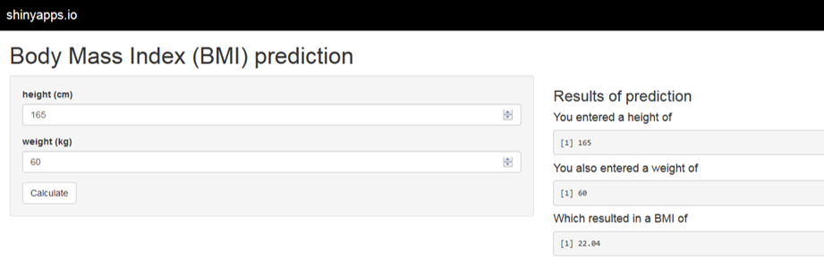

## Creating a BMI Calculator


This slidify presentation describes a very simple tool to calculate body mass index from height and weight measurements

---


## Specifications


To make it easy it is specified that measurements must be entered as SI units.


Therefore weight must be entered in kilograms, and height in centimetres. 


(Please note any supposed typos (metre vs meter) are due to my English/Australian background and not my lack of literacy skill!!!)

---

## Calculation


BMI is calculated as $$\frac{weight(kg)}{height(m)^2}$$


So for a weight of 55kg and a height of 165cm the BMI would be calculated as 


```{r}
55/((165/100)^2)
```


---

## The App

An online version of the app can be found at https://scb-csiro.shinyapps.io/Week3

and will look something like this:


